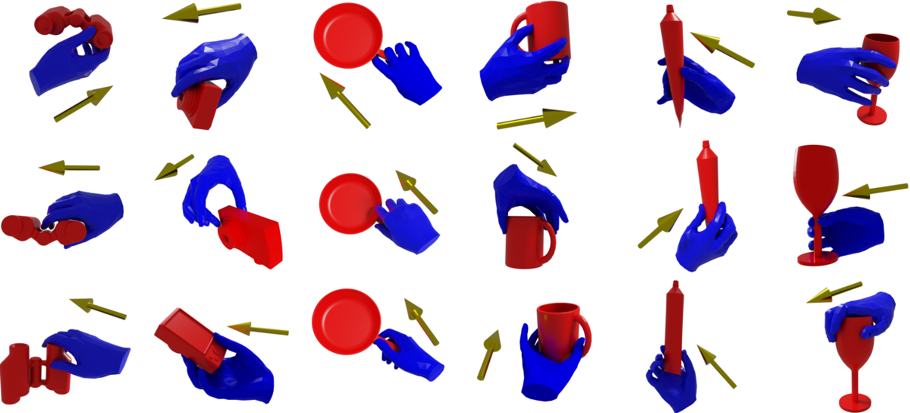

# CGrasp
This repository is the official implementation of the CGrasp model from 
our __3DV 2025__ paper:

**3D Whole-body Grasp Synthesis with Directional Controllability**
(https://gpaschalidis.github.io/cwgrasp/).

<a href="">

</a>

<p align="justify">
CGrasp is a generative model for hand grasp generation, conditioned on a given direction. The generated
hand follows the specified direction. 
</p>

## Installation & Dependencies
Clone the repository using:

```bash
git clone git@github.com:gpaschalidis/CGrasp.git
cd CGrasp
```
Run the following commands:
```bash
conda create -n cgrasp python=3.9 -y
conda activate cgrasp
conda install pytorch=2.0.1 torchvision torchaudio pytorch-cuda=11.7 -c pytorch -c nvidia
pip install kaolin==0.16.0 -f https://nvidia-kaolin.s3.us-east-2.amazonaws.com/torch-2.0.1_cu117.html
```
```bash
pip install -r requirements.txt
 ```
## Getting started

#### Mano models
- Download MANO models following the steps on the [MANO repo](https://github.com/otaheri/GrabNet) and save them in the folder "models", following the structure below:
```bash
    models
     └── mano
```
#### GrabNet data (only required for retraining the model or testing on the test objects)
- Download the GrabNet dataset (ZIP files) from [this website](http://grab.is.tue.mpg.de). After following all the instructions
you should have the structure below:

```bash
    GRAB
    ├── data
    │    │
    │    ├── bps.npz
    │    └── obj_info.npy
    │    └── sbj_info.npy
    │    │
    │    └── [split_name] from (test, train, val)
    │          │
    │          └── frame_names.npz
    │          └── grabnet_[split_name].npz
    │          └── data
    │                └── s1
    │                └── ...
    │                └── s10
    └── tools
         │
         ├── object_meshes
         └── subject_meshes
```

- To test CGrasp you need the pre-trained RefineNet model from GrabNet. Download this model from the [GRAB website](https://grab.is.tue.mpg.de), 
and move it in the folder "pretrained" as described below:
```bash
     cgrasp
        └── cgrasp
              └── pretrained
                     └── refinenet.pt
```
## Train CGrasp
To train CGrasp from scratch use the following command:

```bash
python train.py --config_path cgrasp/configs/cgrasp_cfg.yaml --data_path GRAB/data/ --rhm_path models/mano/ --save_dir save
```

## Test Grasp
To try CGrasp and visualize the generated grasps together with the input grasp directions:

- First download our pre-trained model from [here](https://docs.google.com/forms/d/1tpUAQms4sAHOj87bsKhPAsCffCj74Y0cD-ywi7pxB_E/edit) and place it in the folder "pretrained". The folder "pretrained" should have the following structure:
```bash
     cgrasp
        └── cgrasp
               └── pretrained
                     │ 
                     ├── cgrasp_cfg.yaml
                     ├── cgrasp.pt                     
                     └── refinenet.pt
```                     
- And then run the following command after picking a ".ply" file from the path "GRAB/tools/object_meshes":

```bash
python generate_grasps.py --obj_path GRAB/tools/object_meshes/banana.ply --rhm_path models/mano --grasp_type "left" --n_samples 1 --save_dir $SAVE_FOLDER
```
You can specify the number of the generated grasps and also the type of the grasp (left or right).

## Citation
If you found this work influential or helpful for your research, please cite:
```
@inproceedings{paschalidis2025cwgrasp,
  title     = {{3D} {W}hole-Body Grasp Synthesis with Directional Controllability},
  author    = {Paschalidis, Georgios and Wilschut, Romana and Anti\'{c}, Dimitrije and Taheri, Omid and Tzionas, Dimitrios},
  booktitle = {{International Conference on 3D Vision (3DV)}},
  year      = {2025}
 }
```
